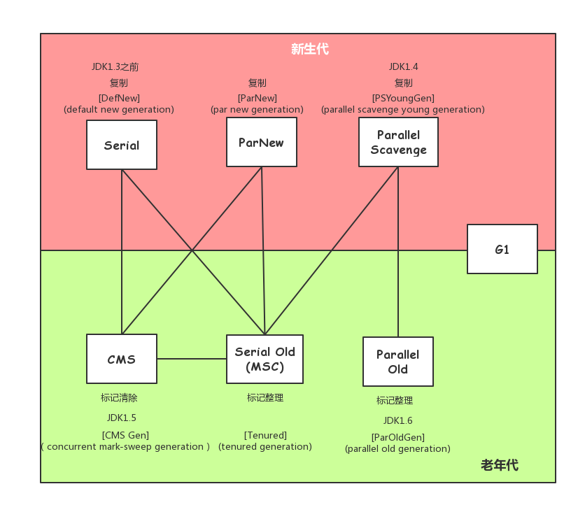

# 深入理解JVM虚拟机
```
JVM
 |---- jvm-bytecode                                                   Simple Java Byte Code Modifier
 |         |---- src/main/java
 |                     |---- com.jvm.bytecode
 |                                  |---- ByteUtils.java              字节工具
 |                                  |---- ConstantsPoolModifier.java  修改/替换常量池
                                                                      当前仅支持'Constant_Utf8_info'和'Constant_Fieldref_info'
 |                                  |---- CustomeizeSystem.java       用于替换'java/lang/System'
 |                                  |---- HotSwapClassLoader.java
 |
 |         |---- src/test
 |                  |---- java                                        测试用例
 |                  |---- resources                                   字节码文件或测试输出文件
 |
 |---- jvm-core  
 |         |---- src/main/java
 |                     |---- jvm
 |                            |---- allocate                          内存分配策略
 |                            |---- classloading                      类加载器
 |                            |---- execution.engine                  执行引擎
 |                                          |----- invokedynamic      动态调用
 |                            |---- gc                                垃圾回收
 |                            |---- initialization                    类初始化
 |                            |---- oom                               模拟内存溢出
 |
 |         |---- src/main/test                  
 |
 |---- png
 |---- build.gradle
 |---- readme.md
 |---- settings.gradle
```
## 1. Java 内存区域
1. 程序计数器
2. Java虚拟机栈
3. 本地方法栈
4. Java堆
5. 方法区 - 类信息、常量、静态变量、即时编译器编译后的代码
6. 运行时常量池 - 方法区的一部分
  
    编译期生成的各种字面量和符号引用存放在常量池`Constant Pool Table`中,在类加载后进入方法区的运行时常量池
    
    动态性:运行期间也可以讲新的常量放入池，如`String.intern()`方法

7. 直接内存 `Direct Memory`
  
    JDK1.4 NIO, Channel/Buffer, 使用Native函数库直接分配堆外内存，然后通过一个存储在Java堆中的`DirectByteBuffer`对象作为这块内存的引用进行操作，避免了在Java堆和Native堆中来回复制数据


## 2. OutOfMemoryError异常
### 2.1 Java 堆溢出
```
-Xms 堆最小值、初始堆大小
-Xmx 堆最大值
-XX:+DumpOnOutOfMemoryError 在出现内存溢出异常时，备份出当前堆转储快照

java.lang.OutOfMemoryError:Java heap space
```
分析堆转储快照，发现是内存泄漏`Memory Leak`还是内存溢出`MemoryOverflow`

> 内存泄漏：查看对象到GC Roots的引用链，找出垃圾收集器无法自动回收的原因  
> 内存溢出：-Xms -Xmx参数是否可以继续调大; 对象生命周期是否过长,尝试减少程序运行期内存消耗

### 2.2 虚拟机栈和本地方法栈溢出
```
-Xss 栈容量
```
`StackOverflowError`请求栈深度大于虚拟机所允许的深度.
使用-Xss参数减少栈内存容量，输出StackOverflowError异常,栈的深度也相应减少(单线程)

`OutOfMemoryError`虚拟机在扩展栈时无法申请到足够的空间内存(创建多个线程)

减少最大堆和减少栈容量来换取更多的线程

### 2.3 方法区和运行时常量池溢出
```
JDK 1.7 永久带大小
-XX:PermSize
-XX:MaxPermSize

JDK 1.8 元数据区大小
-XX:MetaspaceSize
-XX:MaxMetaspaceSize
```

> String.intern() 在JDK 1.6中，把首次遇到的字符串实例复制到永久代中，返回的是永久代中这个字符串的引用  
> JDK 1.7 不会复制实例，只是在常量池中记录首次出现的引用

### 2.4 直接内存溢出
```
-XX:MaxDirectMemorySize
```
`DirectByteBuffer`分配内存也会抛出内存溢出异常，但它抛出异常时并没有真正向操作系统申请分配内存，而是通过计算无法分配，于是手动抛出异常；

真正申请内存分配的方法是`unsafe.allocateMemory()` --->  **但测试代码没有达到理想效果, /(ㄒoㄒ)/~~**

## 3. 垃圾收集与内存分配--这样知道为什么我没有对象了！
### 3.1 在或不在
1. 引用计数 Reference Counting *简单高效 -- 循环引用*
2. 可达性分析 Reachability Analysis
  
    GC Roots , Reference Chain引用链
    
    可作为GC Roots的对象：
    1. 虚拟机栈中引用的对象
    2. 方法区中类静态属性引用的对象
    3. 方法区中常量引用的对象
    4. 本地方法栈中JNI(Native方法)引用的对象
3. finalize()-- 拥有**一次**自我救赎的机会, 还是最好不要用, 不可控性太大, JDK9已被标记为废弃方法
4. 方法区回收--废弃常量、无用类
  
    废弃常量：常量池中常量，没有任何对象引用，也没有其他地方引用这个字面量
    
    无用的类
    1. 所有实例已回收
    2. 加载该类的类加载器已回收
    3. 类对应的Class对象没有在任何地方被引用


> 引用  
> Strong Reference 强引用-- GC 永不发生  
> Soft Reference 软引用-- 有用非必须的对象，内存溢出前进行GC，没有足够内存才会抛出内存溢出异常  
> Weak Reference 弱引用-- 描述非必须对象， 只能生存在下一次垃圾收集之前  
> Phantom Reference 虚引用-- 虚引用对对象的生存没有任何影响，无法通过一个虚引用取得一个对象实例

### 3.2 垃圾收集算法
1. 标记-清除 Mark-Sweep 标记清除两个过程的效率都比较低，空间碎片
2. 复制算法  Copying 简单高效--代价太高， 适用于存活率较低的场景
3. 标记-整理算法 Mark-Compact,存活对象向一端移动，然后清除掉边界以外的内存
4. 分代收集

### 3.3 HotSpot相关算法
1. 枚举根节点-GC Roots, OopMap(Ordinary Object Point)数据结构，在类加载完成的时候，对象内什么偏移量上是什么类型的数据就已计算出来，在JIT编译时也会存放栈、寄存器中引用位置

   > GC停顿(Stop the world)---引用分析时，对象的引用关系还在变化的话，引用分析结果的正确性就无法得到保证。即使CMS收集器，枚举根结点时也是必须停顿的
2. 安全点SafePoint-特定位置记录OopMap, 方法调动、循环跳转、异常跳转；用户线程停顿

    抢先式中断 Preemptive Suspension, GC发生时，让线程全部中断，有不在安全点的，就恢复执行到安全点  
    主动式中断 Voluntary Suspension, 设置一个标志，各线程执行时主动去轮询这个标志，发现中断标志为真时，就自己中断挂起(几乎所有的JVM都采用主动式中断)
    
3. 安全区域Safe Region, 程序处于Sleep状态或Blocked状态时，程序无法响应中断请求

    安全区域，一段代码中，引用关系不会发生变化，在这个区域中的任何地方GC都是安全的，离开时，要检测是否完成了GC过程

### 3.4 垃圾收集器

1. Serial--Client模式下新生代收集器，单线程收集器，简单高效
2. ParNew--新生代并行收集，默认开启线程收集数量与CPU数量一致
3. Parallel Scavenge --JDK1.4 新生代复制算法收集器，目标是达到一个可控的吞吐量(Throughput=UserTime/UserTime+GcTime),别的收集器更多的关注停顿时间
  
   (GC Ergonomics)GC自适应调节策略-XX:+UserAdaptiveSizePolicy，不需要手动设置-Xmn(新生代) -XX:SurvivorRatio -XX:PretenureSizeThreshold(晋升老年代大小)
4. Serial Old--老年代标记整理，单线程
5. Parallel Old--JDK1.6 老年代标记整理，多线程 (为了与Parallel Scavenge更好的搭配)
6. CMS/Concurrency Mark Sweep--JDK1.5 老年代标记-清除, 具有划时代的意义(用户线程、GC线程并行执行) 
7. G1/Garbage First--使命：替换掉CMS收集器


    CMS缺点：
    1. CPU资源敏感 (用户线程、GC线程)
    2. 浮动垃圾，Concurrent Mode Failure，会临时启动Serial Old收集器，造成更长停顿时间
    3. 空间碎片
    
    Garbage First优势:
    1. 并行、并发：缩短Stop-The-World停顿时间
    2. 分代收集: 采用不同的方式处理新对象、存活一段时间的对象、熬过多次GC的旧对象
    3. 空间整合: 整体上标记-整理，局部上(两个Region)基于复制
    4. 可预测停顿


| 参数 | 描述 |
| ------ | ------- |
| UseSerialGC | Client模式下的默认值, Serial + Serial Old|
| UseParNewGC | ParNew + Serial Old|
| UseConcMarkSweepGC | ParNew + CMS + Serial Old(Concurrent Mode Failure失败后的后备收集器)|
| UseParallelGC | Server模式下的默认值, Parallel Scavenge + Serial Old |
| UseParallelOldGC | Parallel Scavenge + Parallel Old (JDK 1.8 Server 默认)|
| SurvivorRatio | Eden与Survivor比例 默认为8 |
| PretenureSizeThreshold | 直接晋升老年代对象的大小 |
| MaxTenuringThreshold | 晋升到老年代对象的年龄 |
| UseAdaptiveSizePolicy | 动态调整Java堆各个区域的大小以及进入老年代的年龄 |
| HandlePromotionFailure | 是否允许分配担保失败, 老年代剩余空间无法应对新生代的整个Eden和Survivor区的所有对象都存活的情况 |
| ParallelGCThreads | 并行GC回收的线程数 |
| GCTimeRatio | GC时间占总时间的比率, 默认为99, 1%的GC时间, 在Parallel Scavenge时生效 |
| MaxGCPauseMillis | GC最大停顿时间, 在Parallel Scavenge时生效 |
| CMSInitiatingOccupancyFraction | GC发起占有比例, 老年代空间被使用多少后触发垃圾收集。默认68%|
| UseCMSCompactAtFullCollection | CMS收集器在完成垃圾收集后是否要进行一次内存碎片整理 |
| CMSFullGCsBeforeCompaction | 若干次垃圾收集后启动一次碎片整理 |

### 3.5 内存分配与回收策略
1. 对象优先在Eden分配

    Eden区没有足够的空间进行分配时，虚拟机发起一次Minor GC.

    > Full GC/Major GC:指发生在老年代的GC,速度一般比Minor GC慢10倍以上 

2. 大对象直接进入老年代
  
    大对象：连续内存空间的Java对象，更可怕的是一群短命大对象
    -XX:PretenureSizeThreshold, 大于这个参数的对象直接在老年代分配。该参数只对**Serial、ParNew**有效
    
3. 长期存活对象进入老年代
  
   算算你对象的年龄：
   对象出生于Eden区，经历一次Minor GC仍然存活并且能够移动到Survivor空间中，年龄设为1。以后每经历过一个Minor GC,age+1。
   默认15岁，就是个老年人了... 可以通过-XX:MaxTenuringThreshold设置
   
4. 动态对象年龄判定--如果相同年龄对象大小总和大于Survivor空间的一半，那么年龄大于或等于该年龄的对象可以进入老年代

5. 空间分配担保
```js
if (老年代最大可用连续空间 > 新生代所有对象可用空间) {
    return Minor_GC_Safe  
} else if (HandlePromotionFailure) { // 允许担保失败
    if (老年代最大可用空间连续空间 > 历次晋升到老年代对象的平均大小)
        return Minor_GC; // 尝试进行GC
    else
        return Full_GC;
} else {
    return Full_GC;
}
```
## 4. JVM 性能监控工具

### 4.1 jps (JVM Process Status Tool)虚拟机进程状况
```
jps [-q] [-mlvV] [<hostid>]
```
| 选项 | 作用|
|----- | ----- |
| -q | 省略主类名称 |
| -m | 输出传递给 main() 函数的参数 |
| -l | 主类全名 |
| -v | 虚拟机进程启动时JVM参数|

```sbtshell
jps -v
1646 im-server-1.0.jar -Xverify:none
```

### 4.2 jstat (JVM Statistics Monitoring Tool) 虚拟机统计信息监视工具
显示本地或远程虚拟机进程中的类装载、内存、垃圾收集、JIT编译等运行数据
```sbtshell
jstat -<option> [-t] [-h<lines>] <vmid> [<interval> [<count>]]

~ jstat -options
-class
-compiler
-gc
-gccapacity
-gccause
-gcmetacapacity
-gcnew
-gcnewcapacity
-gcold
-gcoldcapacity
-gcutil
-printcompilation
```
| 选项 | 作用 |
| ----- | ----- |
| -class | 类加载、卸载、空间、类加载时间 |
| -compiler | JIT 编译器编译过的方式、耗时 |
| -gc | Eden、Survivor、Old、Permanent(Metaspace)容量、已用空间和GC时间 |
| -gccapacity | 各个区域使用到的最大最小空间 |
| -gccause | 与gcutil类型，额外输出导致上一次GC原因 |
| -gcutil | 关注使用空间占总空间百分比 |
| -printcompilation | 输出已经被JIT编译的方法 |

> Compiler Time 虚拟机JIT编译器(Just In Time Compiler)编译热点代码(Hot Spot Code). 
> Java代码编译出来后形成的Class文件中存储的是字节码(ByteCode), 虚拟机通过解释方式执行字节码命令, 相比与C/C++编译成本地二进制代码来说, 速度要慢. 
> 为了解决程序解释执行速度问题, 一旦Java方法被调用次数达到一定程度, 就会被判定为热代码交给JIT编译器即时编译为本地代码,提高运行速度.
> 甚至运行期动态编译比C/C++的编译期静态编译出来的代码更优秀, 因为运行期可以收集到很多编译期无法得知的信息.

```sbtshell
[JDK 11]
➜  ~ jstat -gcutil 1646
  S0     S1     E      O      M     CCS    YGC     YGCT    FGC    FGCT    CGC    CGCT     GCT   
  0.00   0.00  65.38   0.00      -      -      0    0.000     0    0.000     0    0.000    0.000

➜  ~ jstat -gc 1646
 S0C    S1C    S0U    S1U      EC       EU        OC         OU       MC     MU    CCSC   CCSU   YGC     YGCT    FGC    FGCT    CGC    CGCT     GCT   
 0.0    0.0    0.0    0.0   26624.0  17408.0   235520.0     0.0      0.0    0.0    0.0    0.0        0    0.000   0      0.000   0      0.000    0.000
 
S0C: Current survivor space 0 capacity (KB).
S0U: Survivor space 0 utilization (KB).
CCSC: Compressed class committed size (KB).
CCSU: Compressed class space used (KB).
YGC: Number of young generation garbage collection (GC) events.
YGCT: Young generation garbage collection time.
FGC: Number of full GC events.
FGCT: Full garbage collection time.
CGC: ?
CGCT: ?

[JDK 8]
➜  ~ jstat -gcutil 2949
  S0     S1     E      O      M     CCS    YGC     YGCT    FGC    FGCT    CGC    CGCT     GCT   
  0.00   0.00  34.05   0.00  17.39  19.90      0    0.000     0    0.000     -        -    0.000

➜  ~ jstat -gc 2949
 S0C    S1C    S0U    S1U      EC       EU        OC         OU       MC     MU    CCSC   CCSU   YGC     YGCT    FGC    FGCT    CGC    CGCT     GCT   
10752.0 10752.0  0.0    0.0   65536.0  13136.6   175104.0     0.0     4480.0 779.2  384.0   76.4       0    0.000   0      0.000   -          -    0.000

```
详见[jstat](https://docs.oracle.com/en/java/javase/11/tools/jstat.html#GUID-5F72A7F9-5D5A-4486-8201-E1D1BA8ACCB5)

### 4.3 jinfo Java配置信息工具
```sbtshell
[JDK11]
➜  im jinfo -flags 3743
VM Flags:
-XX:CICompilerCount=4 -XX:ConcGCThreads=3 -XX:G1ConcRefinementThreads=10 -XX:G1HeapRegionSize=1048576 -XX:GCDrainStackTargetSize=64 -XX:InitialHeapSize=268435456 -XX:MarkStackSize=4194304 -XX:MaxHeapSize=4294967296 -XX:MaxNewSize=2576351232 -XX:MinHeapDeltaBytes=1048576 -XX:NonNMethodCodeHeapSize=5835340 -XX:NonProfiledCodeHeapSize=122911450 -XX:ProfiledCodeHeapSize=122911450 -XX:ReservedCodeCacheSize=251658240 -XX:+SegmentedCodeCache -XX:+UseCompressedClassPointers -XX:+UseCompressedOops -XX:+UseG1GC 

[JDK8]
➜  ~ jinfo -flags 2949
VM Flags:
-XX:CICompilerCount=4 -XX:InitialHeapSize=268435456 -XX:MaxHeapSize=4294967296 -XX:MaxNewSize=1431306240 -XX:MinHeapDeltaBytes=524288 -XX:NewSize=89128960 -XX:OldSize=179306496 -XX:+UseCompressedClassPointers -XX:+UseCompressedOops -XX:+UseFastUnorderedTimeStamps -XX:+UseParallelGC
```

## 5. JVM 类加载机制

### 5.1 Class Loading 类加载

#### 类加载器
1. Bootstrap ClassLoader: 启动类加载器, 负责加载存放`<JAVA_HOME>/lib`目录中的Jar文件, 并且名字是被虚拟机识别的, 名字不符合的类库放在lib中也不会被加载
2. Extension ClassLoader: 扩展类加载器`sun.misc.Launcher$ExtClassLoader`, 负责加载`<JAVA_HOME>/lib/ext`目录或者`java.ext.dirs`系统变量所指定的类库
3. Application ClassLoader: 应用程序类加载器`sun.misc.Launcher$AppClassLoader`, 加载用户类路径上所指定的类库

> 双亲委托模型  
> 调用类加载器的`loadClass`方法进行类加载时
> 1. 如果当前类已被虚拟机加载, 则直接返回
> 2. 调用当前类加载器的父类加载器(为null则是启动类加载器)的`loadCLass`方法进行类加载
> 3. 调用当前类加载器`findClass`方法进行类加载

```java
public abstract class ClassLoader {
    
    private final ClassLoader parent; // parent class loader
    
    protected Class<?> loadClass(String name, boolean resolve)
        throws ClassNotFoundException
    {
        synchronized (getClassLoadingLock(name)) {
            // First, check if the class has already been loaded
            Class<?> c = findLoadedClass(name);
            if (c == null) {
                long t0 = System.nanoTime();
                try {
                    if (parent != null) {
                        c = parent.loadClass(name, false); // Parent class loader
                    } else {
                        c = findBootstrapClassOrNull(name); // Bootstrap Class Loader
                    }
                } catch (ClassNotFoundException e) {
                    // ClassNotFoundException thrown if class not found
                    // from the non-null parent class loader
                }

                if (c == null) {
                    // If still not found, then invoke findClass in order
                    // to find the class.
                    long t1 = System.nanoTime();
                    c = findClass(name);

                    // this is the defining class loader; record the stats
                    sun.misc.PerfCounter.getParentDelegationTime().addTime(t1 - t0);
                    sun.misc.PerfCounter.getFindClassTime().addElapsedTimeFrom(t1);
                    sun.misc.PerfCounter.getFindClasses().increment();
                }
            }
            if (resolve) {
                resolveClass(c);
            }
            return c;
        }
    }
}
```

> 破坏双亲委托模型:使用`Thread.currentThread().getContextClassLoader()`上下文类加载器或通过`Reflection.getCallerClass()`*仅由Bootstrap和Ext类加载器加载的类才可调用*获取调用者
```java
package com.mysql.jdbc;
public class Driver extends NonRegisteringDriver
     implements java.sql.Driver
 {
	static {
		try {
			DriverManager.registerDriver(new Driver()); // 注册MySQL Driver
		} catch (SQLException E) {
			throw new RuntimeException("Can't register driver!");
		}
	}
}
```

```java
package java.sql;
public class DriverManager {
    
	public static synchronized void registerDriver(java.sql.Driver driver,
            DriverAction da)
        throws SQLException {

        /* Register the driver if it has not already been added to our list */
        if(driver != null) {
            registeredDrivers.addIfAbsent(new DriverInfo(driver, da));
        } else {
            // This is for compatibility with the original DriverManager
            throw new NullPointerException();
        }

        println("registerDriver: " + driver);

    }
    
    @CallerSensitive
    public static Connection getConnection(String url,
        java.util.Properties info) throws SQLException {

        return (getConnection(url, info, Reflection.getCallerClass()));// 获取调用者(应用程序)的Class对象
    }
    
    private static Connection getConnection(
        String url, java.util.Properties info, Class<?> caller) throws SQLException {
        /*
         * When callerCl is null, we should check the application's
         * (which is invoking this class indirectly)
         * classloader, so that the JDBC driver class outside rt.jar
         * can be loaded from here.
         */
        ClassLoader callerCL = caller != null ? caller.getClassLoader() : null; // 应用程序的类加载器
        synchronized(DriverManager.class) {
            // synchronize loading of the correct classloader.
            if (callerCL == null) {
                callerCL = Thread.currentThread().getContextClassLoader(); // 线程上下文类加载器
            }
        }
        
        // .......
    }
    
    // 判断driver是否由classLoader加载
    private static boolean isDriverAllowed(Driver driver, ClassLoader classLoader) {
        boolean result = false;
        if(driver != null) {
            Class<?> aClass = null;
            try {
                aClass =  Class.forName(driver.getClass().getName(), true, classLoader);
            } catch (Exception ex) {
                result = false;
            }

             result = aClass == driver.getClass();
        }

        return result;
    }
}
```

### 5.2 Linking 链接

#### Verification 验证
#### Preparation 准备
#### Resolution 解析
### 5.3 Initialization 初始化
类立即进行初始化的5种情况(对一个类进行主动引用)
1. new、getstatic、putstatic或invokestatic这4条字节码
2. `java.lang.reflect`包中的方法对类进行反射调用
3. 初始化一个类时, 如果父类没有初始化, 则会初始化父类
4. 虚拟机启动时, 会初始化包含main()方法的主类
5. JDK1.7及以上支持动态语言的版本, `java.lang.invoke.MethodHandle`实例最后的解析结果是`REF_getStatic`,`REF_putStatic`, `REF_invokeStatic`的方法句柄, 这些方法句柄所对应的类

### 5.4 Unloading 卸载


## 6. 虚拟机字节码执行引擎

## 7. 运行期优化

## 8. Java 内存模型
